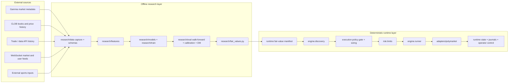
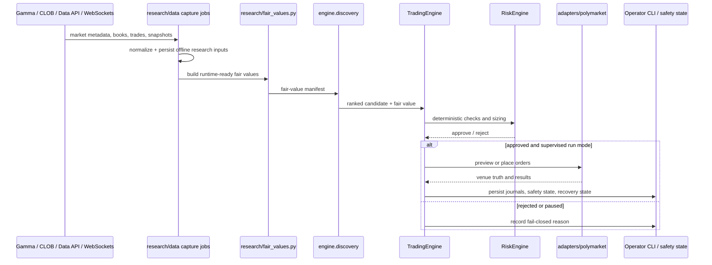

# Sports + Polymarket Architecture

This document is a **target architecture** for extending the current repo into a cleaner sports-modeling and Polymarket execution workspace. It builds on the current verified runtime described in `docs/ARCHITECTURE.md`: deterministic discovery, policy-gated execution, supervised operation, and offline fair-value generation.

The core rule does not change: **the runtime stays deterministic and policy-driven**. LLMs can help with research, operator workflows, and offline analysis, but they do not directly decide whether to buy or sell.

## Architectural decisions

Keep this as **one repo**, but separate responsibilities cleanly:

- keep venue I/O in `adapters/`
- keep supervised runtime behavior in `engine/`, `risk/`, and `runtime/`
- keep data capture, feature engineering, model training, evaluation, and fair-value generation in `research/`
- keep raw live captures, large historical datasets, model checkpoints, and runtime state **out of git**

The repo should keep code, configs, docs, tests, tiny fixtures, and manifest schemas in git. It should **not** use `runtime/` as an ML training warehouse.

## Recommended target tree

```text
prediction-market-agent/
├── adapters/
│   ├── polymarket/
│   │   ├── gamma_client.py
│   │   ├── clob_client.py
│   │   ├── ws_market.py
│   │   ├── ws_sports.py
│   │   ├── ws_user.py
│   │   └── normalize.py
│   └── types.py
├── engine/
│   ├── discovery.py
│   ├── runner.py
│   ├── runtime_policy.py
│   ├── reconciliation.py
│   ├── order_state.py
│   └── safety_store.py
├── risk/
│   ├── limits.py
│   └── cleanup.py
├── research/
│   ├── data/
│   │   ├── capture_polymarket.py
│   │   ├── capture_sports_inputs.py
│   │   ├── schemas.py
│   │   └── build_training_set.py
│   ├── features/
│   │   ├── market_features.py
│   │   ├── sports_features.py
│   │   └── joiners.py
│   ├── models/
│   │   ├── elo.py
│   │   ├── bradley_terry.py
│   │   ├── blend.py
│   │   └── calibration.py
│   ├── train/
│   │   ├── train_elo.py
│   │   ├── train_bt.py
│   │   └── train_blend.py
│   ├── eval/
│   │   ├── walk_forward.py
│   │   ├── metrics.py
│   │   ├── dm_test.py
│   │   └── reports.py
│   ├── replay/
│   ├── fixtures/
│   └── fair_values.py
├── runtime/
│   ├── state/
│   ├── cache/
│   ├── journals/
│   └── fair_values/
├── scripts/
│   ├── ingest_live_data.py
│   ├── train_models.py
│   ├── build_fair_values.py
│   ├── run_agent_loop.py
│   └── operator_cli.py
├── configs/
│   ├── sports_nba.yaml
│   ├── sports_nfl.yaml
│   └── runtime_policy.preview.json
├── tests/
├── docs/
├── Dockerfile
├── Makefile
├── pyproject.toml
└── README.md
```

## Diagram 1 — Offline training and runtime boundary

This diagram answers: **how should offline sports research connect to the supervised Polymarket runtime without letting training logic leak into execution?**



The important boundary is between `research/` and the supervised runtime. Research can ingest, fit, calibrate, and evaluate. Runtime consumes a manifest and stays deterministic.

## Diagram 2 — Live ingestion and supervised operation loop

This diagram answers: **how should Polymarket data ingestion, fair-value generation, and supervised execution connect during a live sports workflow?**



This keeps live behavior aligned with the current verified repo flow: load truth, rank opportunities, look up fair value, generate intents, run deterministic checks, size, run risk, place or preview, reconcile, and persist safety state.

## Polymarket integration layers

Treat Polymarket as several distinct integration layers, not one flat adapter:

- **Gamma** for public market discovery and metadata
- **CLOB** for order book state and price-oriented trading access
- **trade/data history endpoints** for historical trades and analysis inputs
- **WebSockets** for higher-frequency market, sports, or user-state updates

In practice, use them differently:

- **Gamma** for event-first discovery, market metadata, and ID resolution such as `conditionId` and CLOB token identifiers
- **CLOB** for tradable microstructure data such as books, prices, midpoints, and price history, plus authenticated trading operations when needed
- **trade/data history** for historical fills, trade analysis, and user or market activity views
- **WebSockets** for streaming public market updates and authenticated user-state updates where polling would be too expensive or stale

Capture jobs should batch where possible, back off independently per layer, and prefer WebSockets for high-frequency updates instead of polling everything at the same cadence. Design rate limiting as a per-layer concern rather than a single shared global assumption.

Useful implementation notes:

- prefer Gamma keyset pagination for broad market discovery
- prefer CLOB batched market-data endpoints where available instead of one-market polling loops
- treat Gamma, CLOB, and Data API limits as separate operational budgets
- keep heartbeat handling explicit for websocket consumers and fail closed when streams go stale

## Research split

### `research/data/`

Store normalized offline inputs for:

- external sports inputs
- Polymarket metadata from Gamma
- CLOB price history
- trade/data history
- your own captured live book snapshots

### `research/features/`

Keep two feature families separate:

- **sports features** such as Elo, team strength, rest days, injuries, opening odds, and line movement
- **market microstructure features** such as spread, midpoint, imbalance, liquidity, trade velocity, and time-to-start

### `research/models/`

Start with:

- odds-only baseline
- Elo or Bradley–Terry
- blended model
- calibration layer

### `research/eval/`

Use **walk-forward only**. No random split. Primary metrics should be log loss, Brier, expected calibration error, and Diebold–Mariano-style comparisons on held-out future windows.

### `research/fair_values.py`

This should emit the runtime-ready manifest the repo already expects, including:

- `fair_value`
- optional `calibrated_fair_value`
- `generated_at`
- `condition_id`
- `event_key`
- `sport`
- `series`
- `game_id`

That keeps the runtime contract stable while model and training logic evolve behind it.

## Runtime rules

The runtime remains supervised and fail-closed.

- `engine.discovery` ranks and filters opportunities
- `engine/runtime_policy.py` remains the schema-validated policy boundary
- `engine/runner.py` remains the orchestration and reconciliation core
- `risk/limits.py` remains the deterministic trading constraint layer
- `runtime/` remains operational state, cache, journals, and fair-value artifacts

Do not let an LLM bypass this path. The operator layer can assist with research, explanations, or manual workflows, but the execution decision path should remain explicit, deterministic, and testable.

### Current runtime naming contract

Use the repo’s current naming rather than inventing a parallel vocabulary:

- modes: `preview`, `run`, `pair-preview`, `pair-run`
- preview path: `preview_once` followed by a sized `preview_context`
- placement path: `run_precomputed`
- gate stages: `sizer`, `engine_review`, `policy_gate`, `placement`
- reconciliation actions: `ok`, `resync`, `halt`
- action policy outcomes: `allow`, `hold`, `recover-first`
- Polymarket admission outcomes: `allow`, `refresh_then_retry`, `deny`, `shrink_to_size`

That keeps this target architecture aligned with the existing runtime logs, policy traces, and supervised operator flow.

## Practical minimal implementation plan

### Week 1

- add `adapters/polymarket/gamma_client.py`
- add `adapters/polymarket/ws_market.py`
- add `adapters/polymarket/ws_sports.py`
- add `research/data/capture_polymarket.py`
- write a normalized snapshot schema

### Week 2

- build `research/features/market_features.py`
- add `research/models/elo.py`
- add `research/models/blend.py`
- make `research/fair_values.py` emit runtime-ready manifests

### Week 3

- add `scripts/ingest_live_data.py`
- add `scripts/train_models.py`
- add `scripts/build_fair_values.py`
- run preview-only from `run-agent-loop`

### Week 4

- add walk-forward evaluation
- add calibration and DM tests
- add a single sports-league end-to-end benchmark

## Git and storage policy

Keep in git:

- source code
- configs
- docs
- tests
- tiny fixtures
- manifest schemas

Keep out of git:

- raw live captures
- large historical datasets
- model checkpoints
- runtime state

That is the cleanest way to keep research reproducible without mixing operational state, offline data warehousing, and supervised runtime recovery files.
