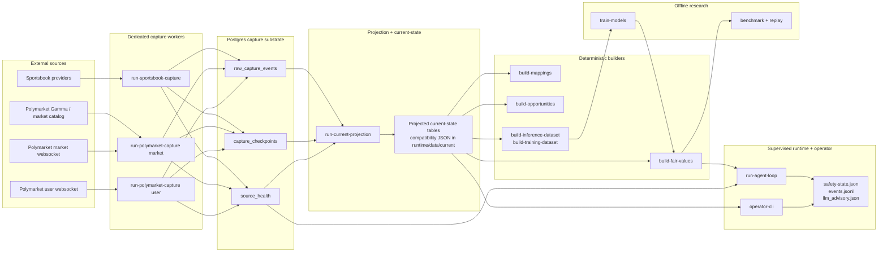
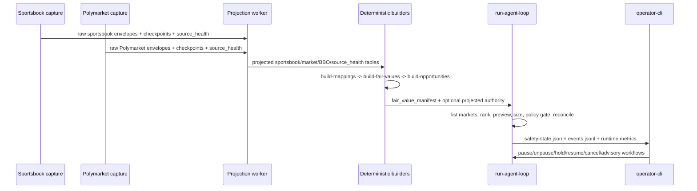

# Sports + Polymarket Architecture

This document now describes the **current implemented sports + Polymarket architecture** in this repo. It complements `docs/ARCHITECTURE.md` by zooming in on the sports-input, Polymarket-capture, projection, deterministic-builder, and supervised-runtime paths that are active today.

The core rule still does not change: **the runtime stays deterministic and policy-driven**. LLMs can help with research, dashboards, and operator workflows, but they do not directly decide whether to buy or sell.

## Current architecture in one view

## The important implementation boundary

The architecture now has a clean split between:

- **capture/projection/builders**, which own the data substrate and deterministic materialization path, and
- **the supervised runtime**, which still lists live venue markets, applies runtime policy, and reconciles against venue truth.

That means the projected current-state tables help power deterministic builders, operator preview context, advisory generation, and kill-switch health, but they do not replace the live adapter-driven runtime loop.

## Current package responsibilities

### Capture and projection

- `services/capture/sportsbook.py` and `services/capture/worker.py` own sportsbook raw ingress
- `services/capture/polymarket.py` and `services/capture/polymarket_worker.py` own Polymarket market/user raw ingress
- `services/projection/current_state.py` replays raw lanes into current-state compatibility tables
- `services/projection/worker.py` runs the projection loop

### Contract, forecasting, opportunity, and execution layers

- `contracts/` owns match identity, confidence, resolution rules, and mapping manifests
- `forecasting/` owns fair-value engines, calibration, consensus, scoring, dashboards, and ML helpers
- `opportunity/` owns executable edge, fillability, and market ranking
- `execution/` owns deterministic order proposals and supervised quote-shell helpers

### Runtime and operator control

- `scripts/run_agent_loop.py` builds adapters, fair-value providers, policy gates, and the supervised runtime loop
- `engine/runtime_bootstrap.py` chooses projected current-state authority when a DSN marker exists
- `engine/discovery.py` owns ranking, scan-cycle journaling, deterministic sizing, and policy gating
- `engine/runner.py` owns reconciliation, safety state, and placement/recovery behavior
- `scripts/operator_cli.py` owns supervised inspection and intervention

## Current sports + Polymarket live path

That is the current sports + Polymarket operating shape in code.

## Where offline research fits

The repo also keeps an offline research lane beside the live/current-state architecture:

- `train-models` materializes lightweight model artifacts
- `research/paper.py` and `research/replay.py` drive paper execution and replay
- `run-sports-benchmark` and `run-sports-benchmark-suite` stay the reproducible offline evaluation path
- `run-replay-attribution` materializes execution-label/attribution outputs from replay artifacts

This offline lane can improve or calibrate fair values, but the live runtime still consumes explicit artifacts and remains deterministic.

## Current operational conclusions

- The supported live capture path is `run-sportsbook-capture` plus `run-polymarket-capture`, not the retired `ingest-live-data polymarket-bbo` route.
- The supported read boundary is the projected current-state adapter when a DSN marker exists.
- `runtime/data/current/*.json` is still important for compatibility and debugging, but it is not the primary authority boundary when Postgres-backed projection is configured.
- The runtime remains supervised and fail-closed. The architecture is stronger than the original monolithic runtime/research split, but it still does not claim unattended live trading.
