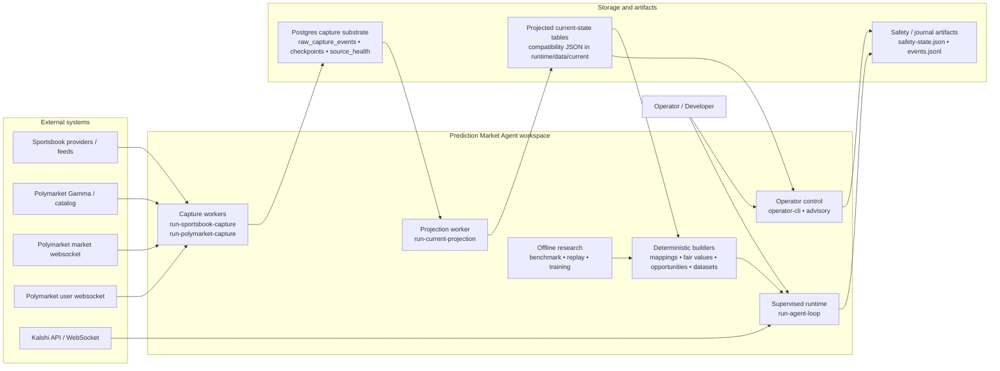

# 01 — System Context

This diagram answers: **what does the current workspace talk to, and what are the major owned boundaries?**

## Read this as

- **capture and projection own the live data substrate**
- **deterministic builders turn projected state into mapping, fair-value, opportunity, and dataset artifacts**
- **`run-agent-loop` stays the supervised venue-facing runtime rather than becoming a generic replay of the projected opportunity table**
