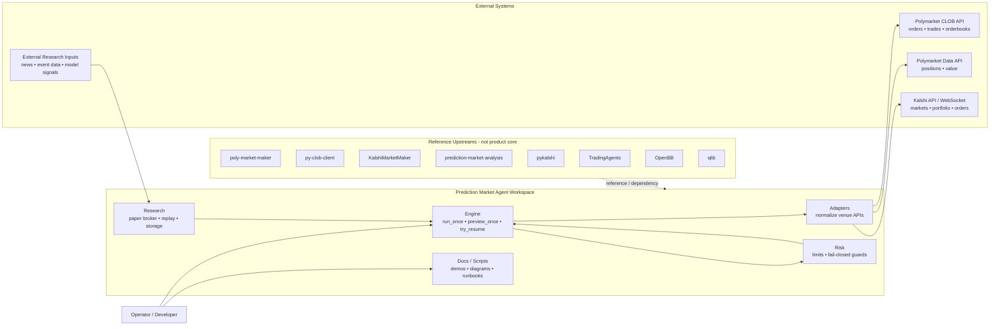

# 01 — System Context

This diagram answers: **what is this bot, what does it talk to, and what does it own?**

## Read this as

- **the workspace owns execution, risk, research, and docs**
- **venue connectivity is delegated to adapters**
- **upstream repos are sources of ideas or wrapped dependencies, not your permanent product core**
