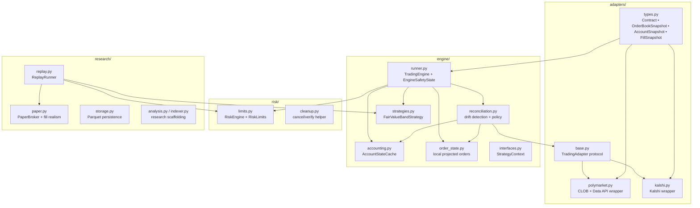

# 02 — Container / Component View

This diagram answers: **what major modules exist inside the workspace, and what each one is responsible for?**

## Main idea

- `adapters/` = venue-specific truth gathering and order transport
- `engine/` = the live orchestrator and safety boundary
- `risk/` = independent gatekeeper
- `research/` = how you improve the bot without risking live capital
