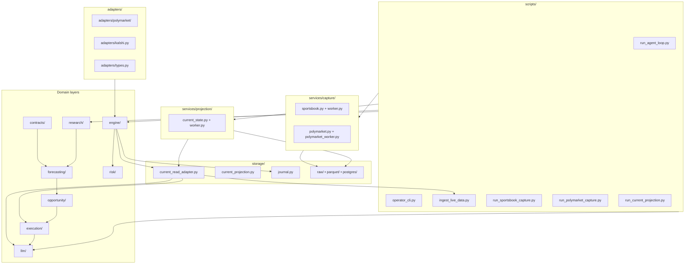

# 02 — Container / Component View

This diagram answers: **what major modules exist inside the workspace, and what each one is responsible for?**

## Main idea

- `services/` + `storage/` now make the capture/projection/current-state substrate explicit
- `contracts/`, `forecasting/`, `opportunity/`, and `execution/` are first-class product layers, not just helpers under `research/`
- `engine/` remains the supervised runtime shell around adapters, policy, reconciliation, and persisted safety state
