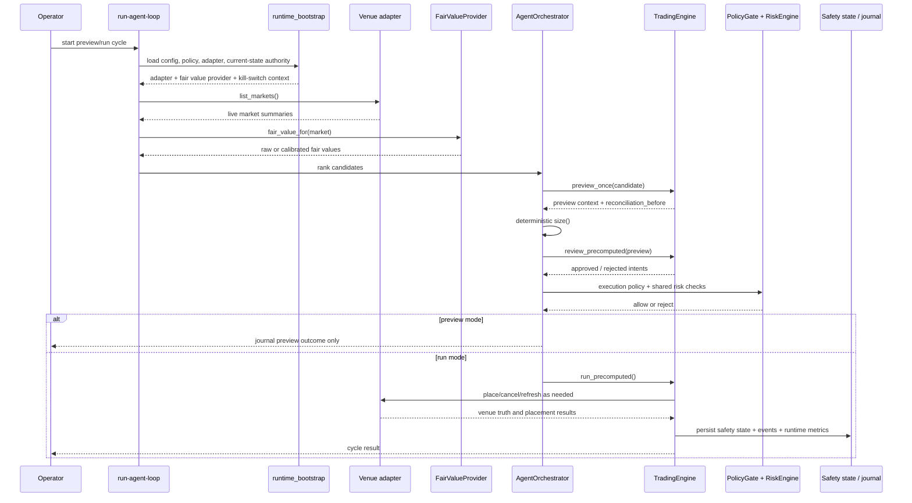

# 03 — Live Runtime Sequence

This diagram answers: **what happens during one supervised `run-agent-loop` cycle?**

## Key design point

The runtime still makes decisions from **live adapter state plus a fair-value provider**. The projected current-state substrate supports kill-switch context, builder workflows, and operator-side preview artifacts, but it does not replace the supervised runtime loop itself.
