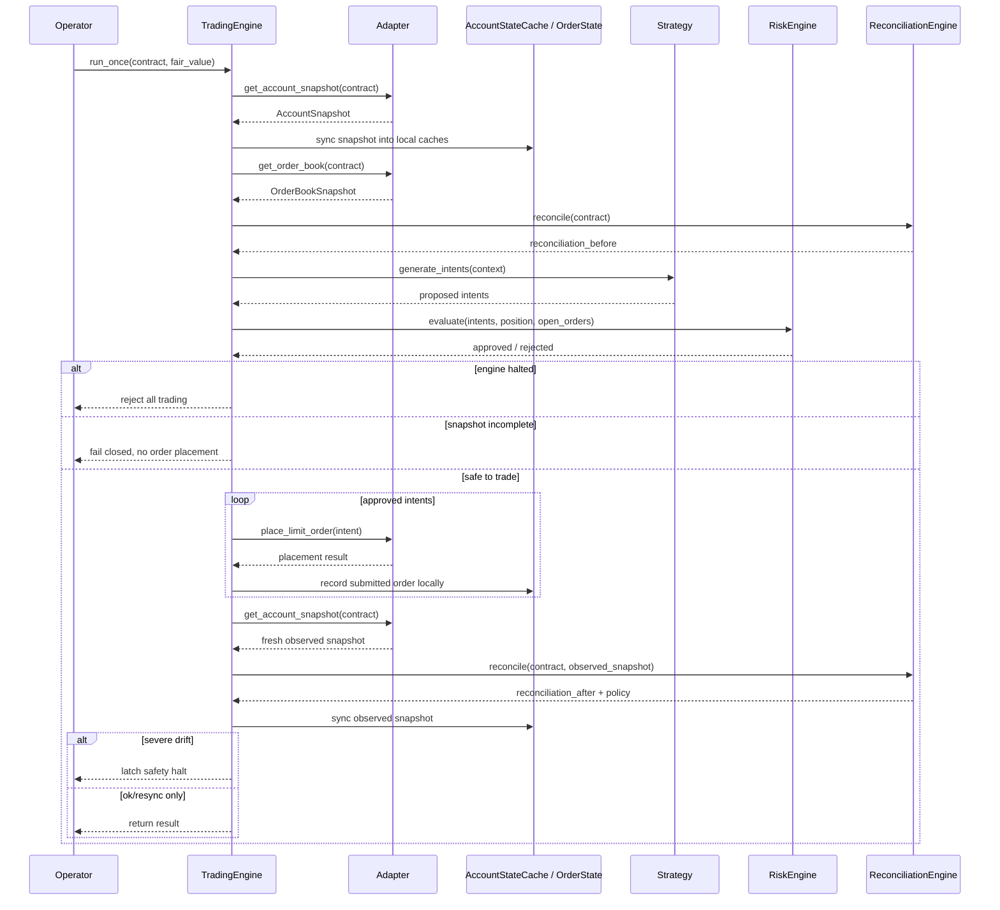

# 03 — Live Runtime Sequence

This diagram answers: **what happens during one live decision cycle?**

## Key design point

The engine does **not** trust local memory first. It restores from venue truth first, then decides.
