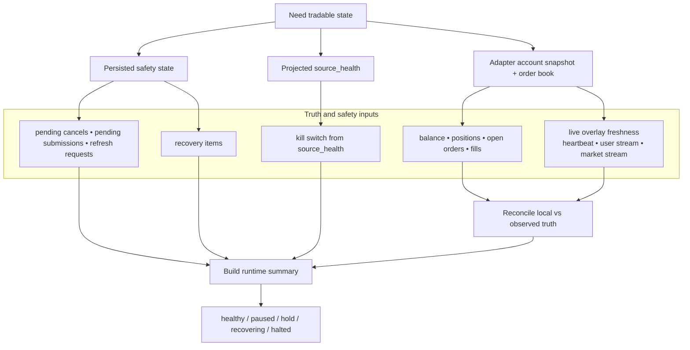
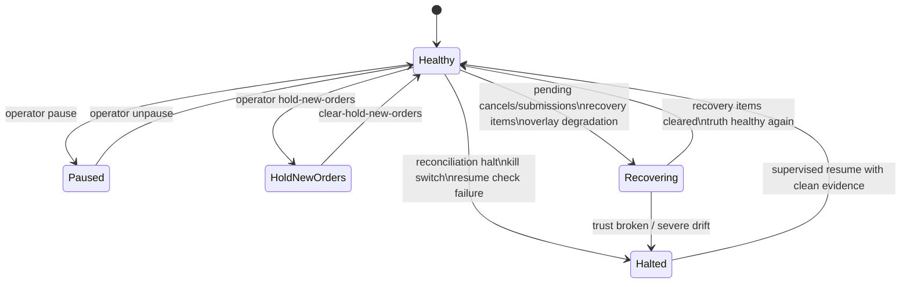

# 04 — Account Truth, Recovery, and Safety State

This file contains the two most important safety views:

1. **how runtime health and truth are assembled and checked**
2. **how pause / hold / recover / halt work**

## 4A. Runtime health and truth inputs

## 4B. Runtime state machine

## What matters most

- the system can **stop itself** when truth, source health, or recovery state becomes unsafe
- kill-switch state is now derived from projected `source_health`, not only from local runtime memory
- a resume is not a blind toggle; it requires a clean supervised check against current truth
