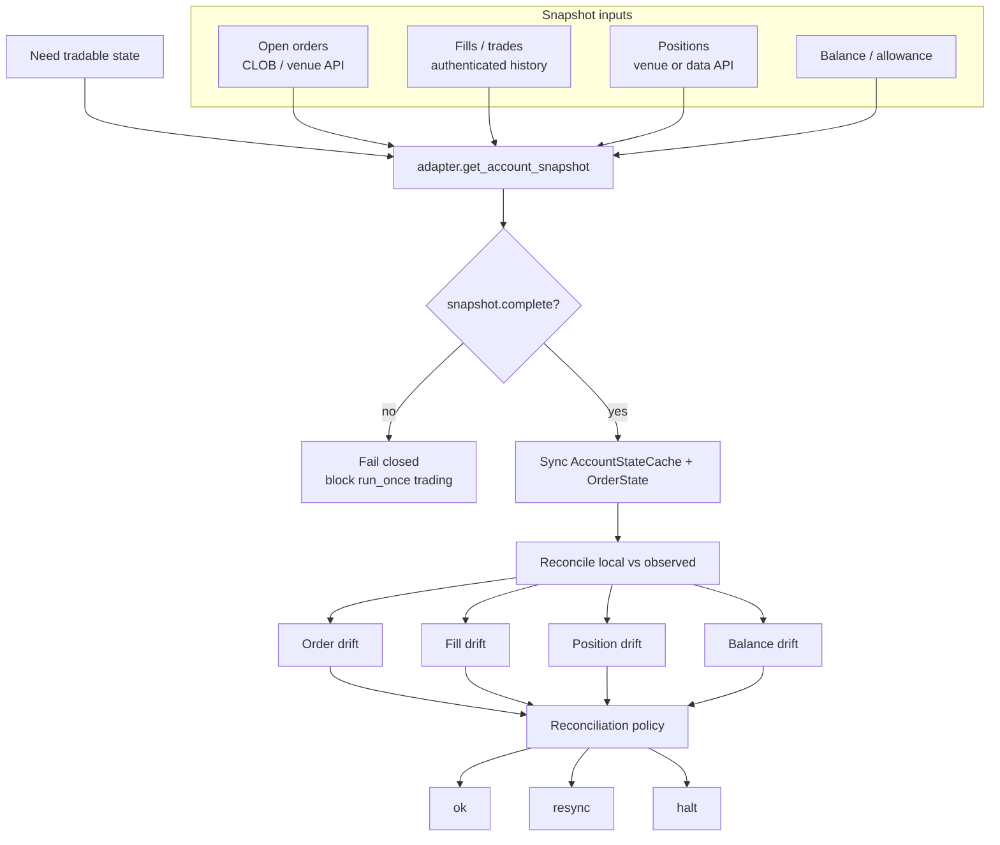
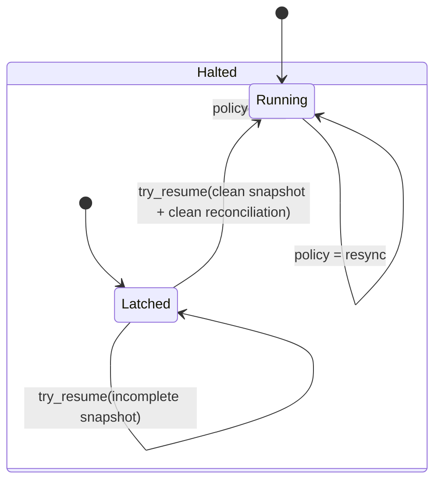

# 04 — Account Truth, Reconciliation, and Safety Halt

This file contains the two most important safety views:

1. **how account truth is assembled and checked**
2. **how halt and resume work**

## 4A. Account Truth and Reconciliation Flow

## 4B. Halt / Resume State Machine

## What matters most

- the bot can **stop itself** when trust is broken
- recovery is **contract-scoped**
- a halt is not cleared by wishful thinking; it needs a clean resume signal
