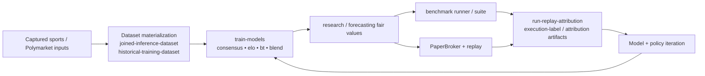

# 05 — Research, Training, Paper Execution, and Replay Loop

This diagram answers: **how do you improve the system without using real money?**

## Reality knobs in paper execution

The paper broker and replay path already support realism controls such as:

- resting orders
- partial fills
- reserved cash / reserved inventory
- `max_fill_ratio_per_step`
- `slippage_bps`
- `resting_max_fill_ratio_per_step`
- `resting_fill_delay_steps`
- `stale_after_steps`
- `price_move_bps_per_step`

The replay result now feeds attribution and execution-label outputs rather than leaving replay as only a single summary metric.
