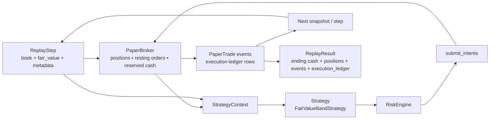

# 05 — Research, Paper Execution, and Replay Loop

This diagram answers: **how do you improve the bot without using real money?**

## Reality knobs in paper execution

The paper broker already supports a few realism controls:

- resting orders
- partial fills
- reserved cash / reserved inventory
- `max_fill_ratio_per_step`
- `slippage_bps`
- `resting_max_fill_ratio_per_step`
- `resting_fill_delay_steps`
- `stale_after_steps`
- `price_move_bps_per_step`

The replay result now feeds post-replay execution metrics and attribution summaries from those execution-ledger rows rather than re-deriving everything from strategy events alone.

This loop is how you should develop strategy changes **before** touching live capital.
