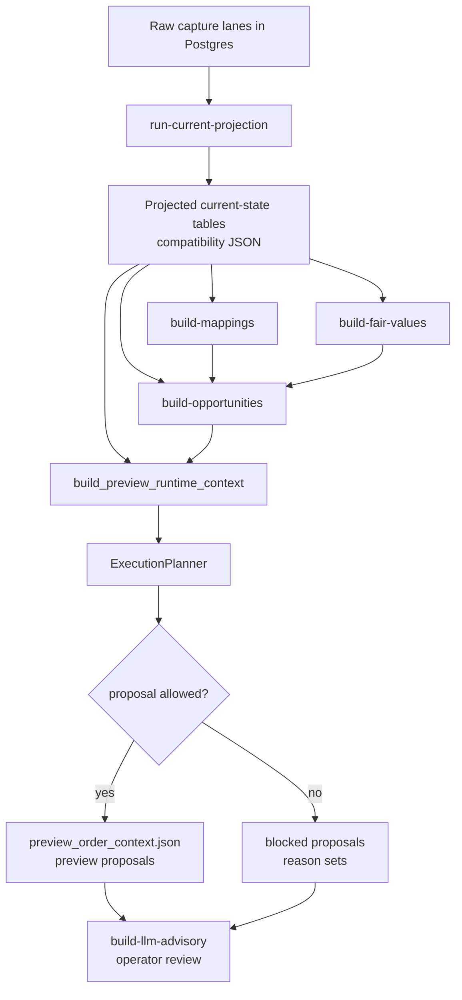

# 06 — Current-State Builder to Proposal Flow

This diagram answers: **how does the projected current-state lane turn captured data into deterministic execution proposals and blocked reasons?**

## Why this flow exists

This is the lane that makes the newer architecture understandable:

- raw capture is separated from current-state projection
- deterministic builders consume projected state rather than raw envelopes directly
- operator-side preview/advisory context is materialized from the same deterministic substrate
- this lane supports the runtime and operator workflows without becoming the runtime itself
