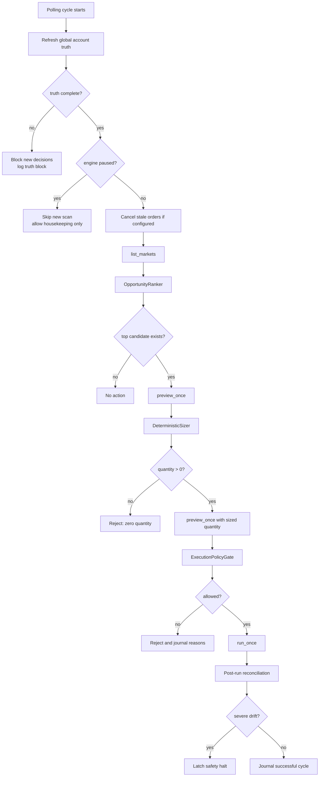

# 06 — Discovery to Execution Decision Flow

This diagram answers: **how does the bot organize itself to find a bet and decide whether to place it?**

```mermaid
flowchart TD
    start[Polling cycle starts] --> truth[Refresh global account truth]
    truth --> complete{truth complete?}
    complete -- no --> block[Block new decisions\nlog truth block]
    complete -- yes --> pause{engine paused?}
    pause -- yes --> skip[Skip new scan\nallow housekeeping only]
    pause -- no --> lifecycle[Cancel stale orders if configured]
    lifecycle --> markets[list_markets]
    markets --> rank[OpportunityRanker]
    rank --> top{top candidate exists?}
    top -- no --> end1[No action]
    top -- yes --> preview[preview_once]
    preview --> size[DeterministicSizer]
    size --> qty{quantity > 0?}
    qty -- no --> end2[Reject: zero quantity]
    qty -- yes --> preview2[preview_once with sized quantity]
    preview2 --> gate[ExecutionPolicyGate]
    gate --> allowed{allowed?}
    allowed -- no --> end3[Reject and journal reasons]
    allowed -- yes --> run[run_once]
    run --> reconcile[Post-run reconciliation]
    reconcile --> halt{severe drift?}
    halt -- yes --> end4[Latch safety halt]
    halt -- no --> end5[Journal successful cycle]
```
