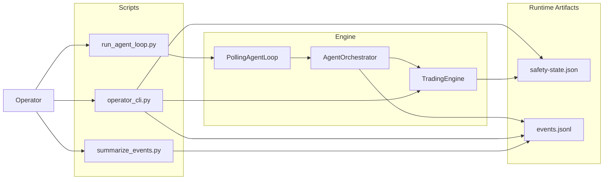

# 07 — Operator Control Plane

This diagram answers: **how does a human supervise the agent while it runs?**

## Main idea

- `run_agent_loop.py` drives repeated cycles
- `operator_cli.py` changes state and inspects runtime
- `safety-state.json` persists halt/pause/truth summary
- `events.jsonl` persists cycle-level decisions and operator actions
