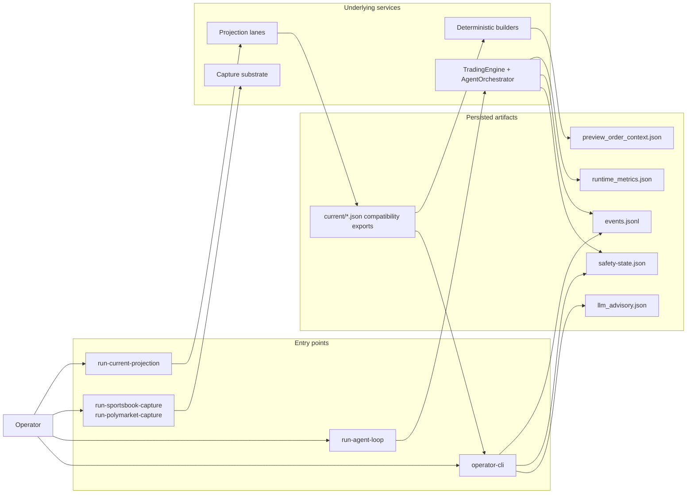

# 07 — Operator Control Plane

This diagram answers: **how does a human supervise the system while workers, builders, and runtime are active?**

## Main idea

- the operator supervises **more than one process now**: workers, projector, runtime, and CLI tooling
- the operator-facing control plane is built from persisted artifacts, not only from the live process memory
- advisory and preview artifacts stay operator-side and deterministic
