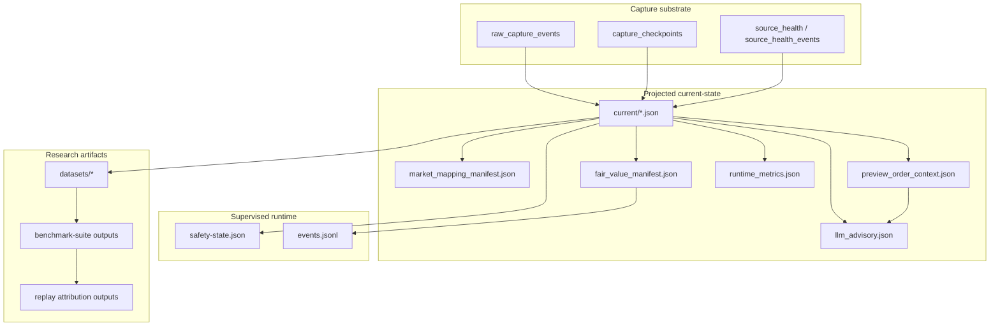

# 08 — Runtime State and Artifacts

This diagram answers: **what persisted artifacts exist now, and what do they tell you after restart or incident review?**

## Why this matters

If the process restarts, the system should not come back forgetful.

- the capture substrate preserves **what was seen and when**
- projected current-state artifacts preserve **what the deterministic builders and operator saw**
- safety state and journal preserve **what the runtime decided and why**
- dataset and benchmark artifacts preserve **how the offline evaluation path was produced**

Together these artifacts make the current architecture far easier to inspect than the earlier single-loop mental model.
