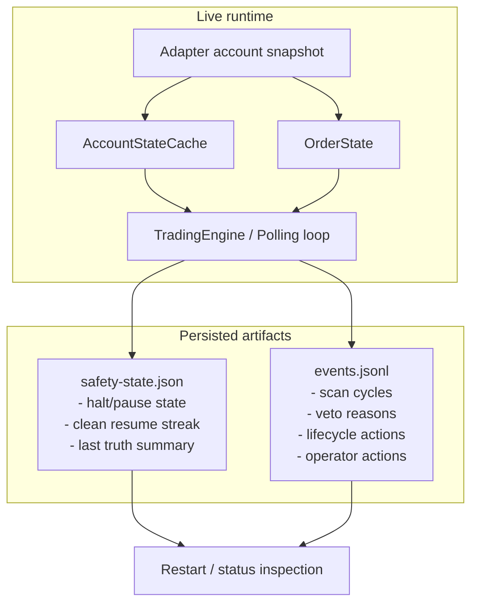

# 08 — Runtime State and Artifacts

This diagram answers: **what persisted artifacts exist, and what do they tell you after restart or incident review?**

## Why this matters

If the process restarts, the bot should not come back “forgetful.”

- `safety-state.json` carries forward the last known safety/truth posture
- `events.jsonl` carries forward the recent decision trail

Together they give the operator a much better starting point than raw memory.
